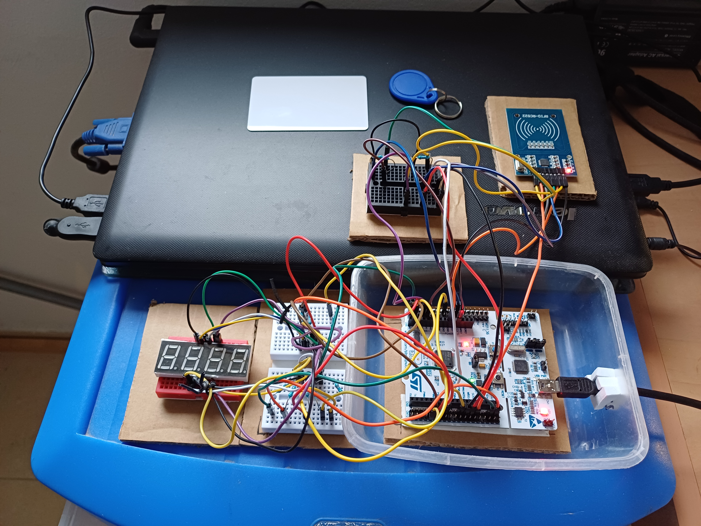
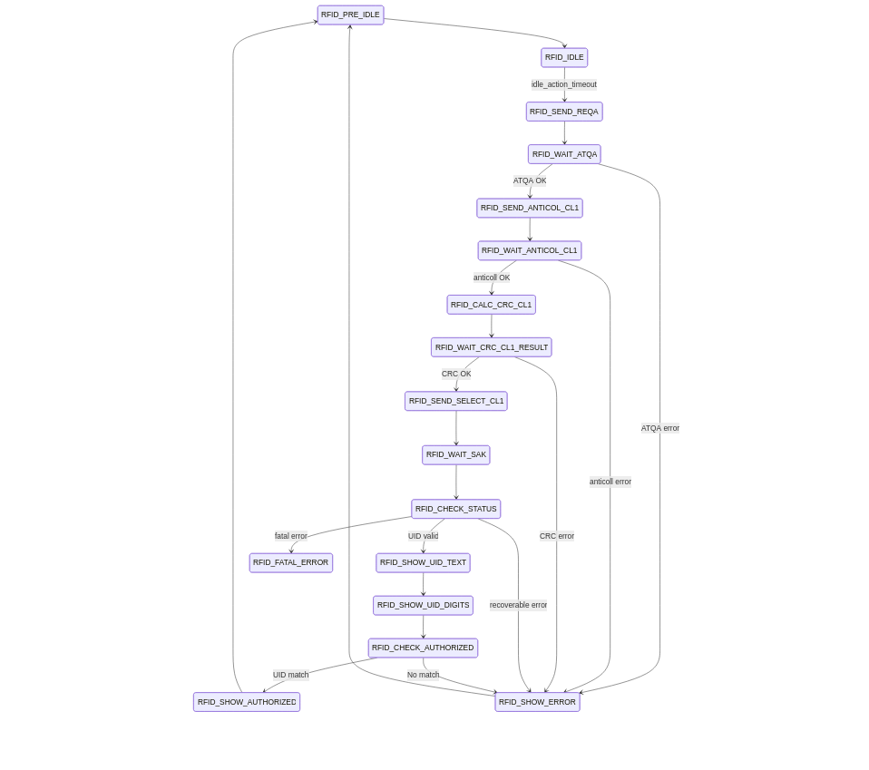

# RFID Reader System - STM32 Firmware Project

## Overview

> **It’s not a demo - it’s a system.**

This project is intentionally designed as a **system-level embedded application**, built **from scratch** using custom peripheral drivers.

The focus is on **modular firmware architecture**, **non-blocking execution**, and **event-driven design**.  
Peripheral drivers (**TIMER, SPI, GPIO, EXTI**) are implemented as independent modules, while higher-level application logic is managed using a clear **finite state machine (FSM)**.

The RFID reader (RC522) operates using **interrupt-based signaling**, allowing the main system to remain responsive.  
At the same time, a **7-segment display is refreshed continuously in the background**, demonstrating concurrent task handling without blocking delays.

This approach reflects real embedded product design considerations such as timing, scalability, and clean API boundaries.

---

## System Architecture

### RFID State Machine - ISO14443A CL1 UID Flow

The FSM reflects the actual firmware implementation and maps directly to the codebase.  
Each protocol phase is explicitly modeled to enable deterministic, non-blocking execution.

---

## Project Structure

- **Src/**        - Source files  
- **Inc/**        - Header files  
- **Documents/** - Media and documentation  
- **tools/**     - Helper scripts (e.g. BSRR bit-mask generation)

---

## Hardware

The RC522 module is connected to the STM32 via SPI.

The RC522 **RST** pin and **CS** pin are held high using external **10 kΩ pull-up resistors** to 3.3 V to ensure stable operation and prevent unintended resets.

The **IRQ** signal is connected to an EXTI-capable GPIO pin for interrupt-driven operation.

The 7-segment display is connected to the STM32 GPIO pins through **current-limiting resistors** for each segment to protect the LEDs and control the segment current.

---

## Status

A complete RFID read flow is implemented, including card detection, UID retrieval, explicit error paths, and real-time 7-segment display feedback.
The system currently supports 4-byte UID cards (CL1).

